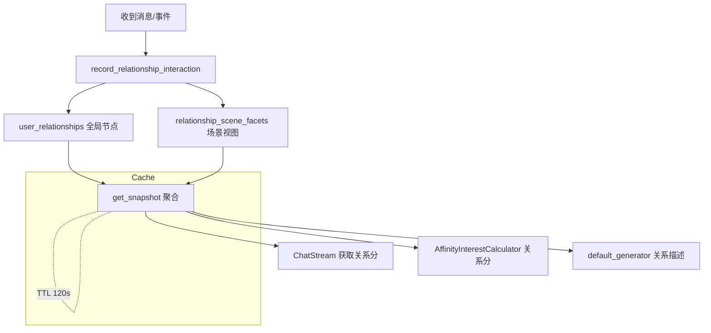

# 人际关系系统说明与风险提示

## 概述
新版人际关系系统引入了全局节点 + 场景视图（relationship_scene_facets）设计，以减少群/跨群/私聊的割裂感，并在读路径上提供聚合快照。

## **重要警告（必读）**
- 本次更新会在数据库中创建新表 `relationship_scene_facets`，写入新的关系数据。
- 该表的写入对现有数据无回滚机制，删除或误操作可能导致关系画像缺失。
- 在更新前 **务必完成数据库备份**，并验证备份可恢复。
- 若使用生产环境，请先在测试/灰度环境验证后再全量上线。

## 备份建议
- SQLite：直接备份 `data/MaiBot.db` 文件（停机或确保无并发写入时进行）。
- PostgreSQL：使用 `pg_dump` 全量导出，示例：
  ```bash
  pg_dump -Fc -h <host> -U <user> <database> > backup.dump
  ```
- 恢复演练：在测试环境执行恢复，确保备份可用。

## 变更摘要
- 新表：`relationship_scene_facets`（场景亲密度、情感分、近期话题等）。
- 新服务：`relationship_profile_service`，提供全局+场景融合的关系快照和交互记录。
- 兼容：旧的全局关系表 `user_relationships` 继续使用；未启用场景分时可配置 `scene_relationship_weight=0` 退化。

## 升级前清单
- [ ] 备份数据库，并验证可恢复。
- [ ] 确认有建表权限（自动 DDL 需要）。
- [ ] 确认配置项 `affinity_flow.scene_relationship_weight`、`base_relationship_score` 是否满足预期。
- [ ] （可选）在测试环境跑一轮启动，确保日志出现 `relationship_scene_facets 已确保存在`。

## 升级后检查
- 查看日志确认自动建表成功。
- 通过 API/调试命令验证 `get_snapshot` 返回包含 scene/global 字段。
- 观察关系查询 P95 和缓存命中率；如异常，检查是否传入正确的 scene 参数。

## 回滚注意
- 回滚代码时保留新表不会影响旧逻辑。
- 若要彻底停用场景分：配置 `scene_relationship_weight=0`，但表中数据仍保留（需要手动清理才会删除）。

## 联系与支持
如遇不可预期的数据问题，请使用备份恢复，并在操作前通知相关维护者。

## 逻辑示意图
